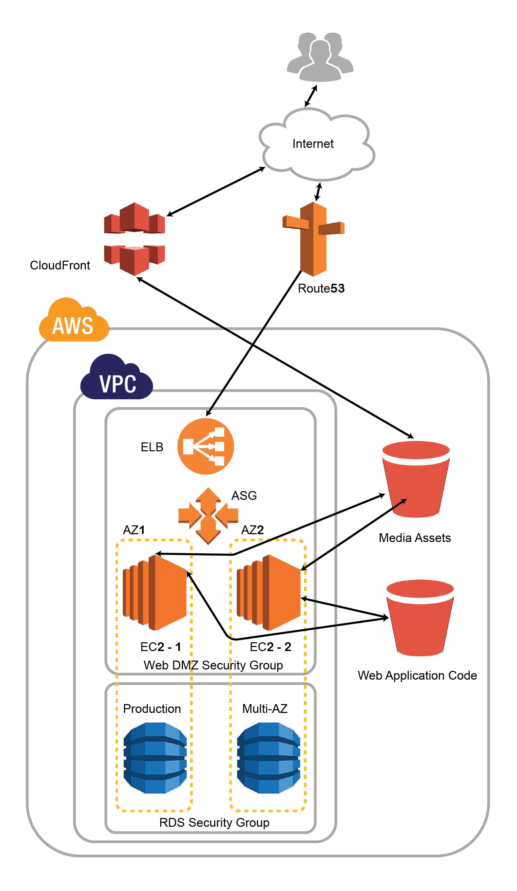

# Animal-House

> Contexte:

Notre project C2 consiste a créer un systeme pour une “animalerie” (maison et hopital pour animaux de compagnie). Ces hopitaux sont très connus en Europe et en Amérique. Ils embauchent differents médecins avec plusieurs cliniques pour prendre soin de tous leurs clients et leurs animaux domestiques. Ces endroits sont connu aussi comme magasin spécialisé dans la vente de petits animaux de compagnie ainsi que de produits (nourriture, produits de traitement, litière, etc.) et accessoires (aquariums, cages, sellerie, etc.) qui leur sont destines. De plus, Ils possèdent des animaux pour adoptions.

> Objectif:

Les objectifs principals de ce syteme sont:

- Accès aux clients enregistrés dans le systeme avec possibilité d’ajouter de nouveaux members et leur donner un code d’activation pour accéder à leur compte dans les differents interfaces web et mobiles.
- Accès aux animaux domestiques enregistrés dans le systeme avec possibilité d’ajouter de nouveaux animaux et leur connecter à un certain client.
- Accès aux medecins enregistrés dans le systeme avec possibilité d’ajouter de nouveaux medecins avec leurs horaires de disponibilité.
- Manipuler les animaux pour adoption.
- Capabilité de prendre des rendez-vous en ligne et manipuler ces rendez-vous dans le systeme.
- Ajouter et manipuler des produits à vendre.
- Ajouter des Nouvelles à propos de l’animalerie ou à propos des animaux en génerale.

> Périmètre:

Ce project est addressé aux differentes animaleries dans les pays developpés. Toute la population peut utiliser l’application web et mobile pour profiter de ses fonctionalités mais seules les clients enregistreés dans le systeme peuvent s’identifier pour accéder à leur profile, prendre des rendez-vous, voir leurs précédentes visites medicales et de manipuler leurs animaux domestiques.

> Fonctionnement:

Ce systeme sera capable de traduire les besoins suivants:

- Voir, mettre à jour et effacer un client
- Permettre à un client de s’identifer dans les applications mobiles et web à travers un code d’activation généré lors de sa creation dans le systeme.
- Voir, mettre à jour et effacer un animal liée à un certain client
- Voir, mettre à jour et effacer un medecin
- Voir, mettre à jour et manipuler l’horaire d’un medecin
- Voir, mettre à jour et effacer une nouvelle.
- Voir, mettre à jour et effacer un animal pour adoption
- “Adopter un animal” en l’effacant des animals pour adoption et l’ajouter à une table historique en ajoutant des informations sur la personne qui l’a adopté.
- Voir, mettre à jour et effacer un type de rendez-vous (vaccination, test be bien être…) (chaque type possedant un temps de procedure).
- Voir, mettre à jour et effacer une catégorie d’animal (chien, chat…)
- Voir, mettre à jour et effacer une espèce d’animal (buchon, caniche…)
- Voir, mettre à jour et effacer un produit à vendre.
- Accéder aux produits, aux medecins et aux Nouvelles dans l’application mobile et web pour un client ordinaire ou engistré
- Accéder aux rendez-vous dans l’application mobile et web pour un client enregitré seulement.
- Identification pour medecin dans l’application mobile et web pour acceder à leur rendez-vous.

> Architecture D'infrastructure

- Amazon Route 53 est un service Web DNS (Cloud Name System) hautement disponible et évolutif.
- Amazon CloudFront est un service de réseau de distribution de contenu rapide (CDN) qui transmet de manière sécurisée des données, des vidéos, des applications et des API à des clients du monde entier avec une latence faible et des vitesses de transfert élevées.
- Amazon Simple Storage Service (Amazon S3) est un service de stockage d'objets offrant une évolutivité, une disponibilité des données, une sécurité et des performances inégalées sur le marché. Cela signifie que les clients de toutes tailles et de tous secteurs peuvent l'utiliser pour stocker et protéger toute quantité de données dans divers cas d'utilisation, tels que sites Web, applications mobiles, sauvegarde et restauration, archivage, applications d'entreprise, appareils IoT et analyses de données volumineuses. Amazon S3 fournit des fonctionnalités de gestion conviviales vous permettant d'organiser vos données et de configurer des contrôles d'accès finement paramétrés pour répondre à vos exigences commerciales, organisationnelles et de conformité spécifiques. Amazon S3 est conçu pour 99,999999999% (11 9) de durabilité
- Amazon Virtual Private Cloud (Amazon VPC) vous permet de provisionner une section du nuage AWS isolée logiquement dans laquelle vous pouvez lancer des ressources AWS dans un réseau virtuel que vous définissez. Vous avez un contrôle total sur votre environnement de réseau virtuel, y compris la sélection de votre propre plage d'adresses IP, la création de sous-réseaux et la configuration de tables de routage et de passerelles réseau. Vous pouvez utiliser à la fois IPv4 et IPv6 dans votre VPC pour un accès sécurisé et facile aux ressources et aux applications.
- Elastic Load Balancing automatically distributes incoming application traffic across multiple Amazon EC2 instances. It enables you to achieve greater levels of fault tolerance in your applications, seamlessly providing the required amount of load balancing capacity needed to distribute application traffic. Elastic Load Balancing detects unhealthy instances and automatically reroutes traffic to healthy instances until the unhealthy instances have been restored. Elastic Load Balancing can also be used in an Amazon Virtual Private Cloud (“VPC”) to distribute traffic between application tiers in a virtual network that you define.
- Amazon Elastic Compute Cloud (Amazon EC2) est un service Web qui fournit une capacité de calcul sécurisée et redimensionnable dans le cloud. Il est conçu pour faciliter l'informatique en nuage sur le Web aux développeurs. La simple interface de service Web d’Amazon EC2 vous permet d’obtenir et de configurer une capacité avec un minimum de friction. Il vous offre un contrôle complet de vos ressources informatiques et vous permet de fonctionner sur l'environnement informatique éprouvé d'Amazon.
- Les groupes de sécurité Amazon RDS vous permettent de gérer l'accès réseau à vos instances Amazon RDS. Avec les groupes de sécurité, vous spécifiez des ensembles d'adresses IP à l'aide de la notation CIDR et seul le trafic réseau provenant de ces adresses est reconnu par votre instance Amazon RDS.

> Ressources:

Ce projet se compose de:

- 1 personne pour les interfaces de programmation pour application web et mobile, les interfaces de programmation pour les CRUD et l’interface utilisateur de CRUD.
- 1 personne pour l’application mobile ([Android](https://github.com/c2-beirut-2019/Android-Project)).
- 1 personne pour l’application mobile ([IOS](https://github.com/c2-beirut-2019/iOS-Project)).
- 1 personne pour l’application [Web](https://github.com/c2-beirut-2019/Web-Project).
